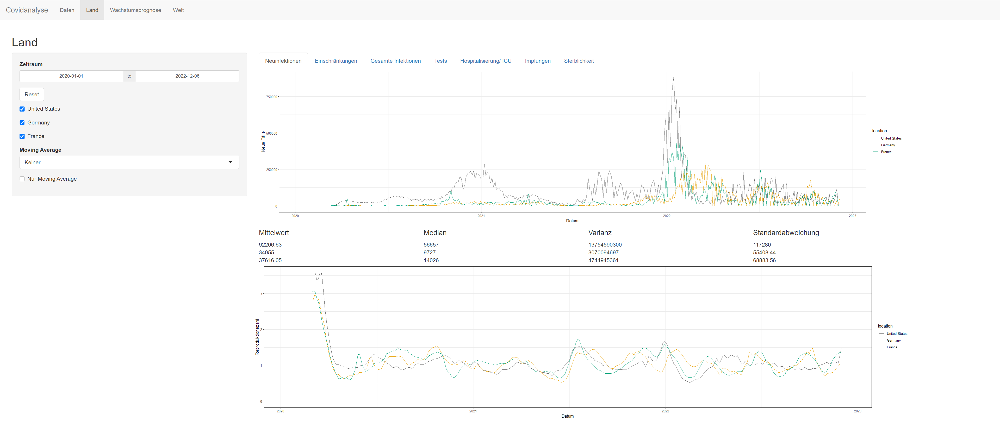

## Overview

This project was part of a group work in my degree in mathematics.
This was started in 2022 when Covid-19 was on the rise.
Goal of this project was to visualize Covid-19 related data from the [WHO](https://catalog.ourworldindata.org/garden/covid/latest/compact/compact.csv).
We wrote a small app where you can select different metrics and compare different countries.

  

Using the simple to navigate interface you can easily do this.

## Capabilities
- Choose different countries to compare
- Visualize key metrics
- Restrict observed period of time
- Add moving average
- Forecast future number of infections
- View metrics for the whole world

## How to run
Start the `server.R` file.
This starts a server which you can interact with using the [R Studio](https://posit.co/products/open-source/rstudio/) client.

## Requirements
- R
- shiny
- DT
- ggplot2
- tidyquant